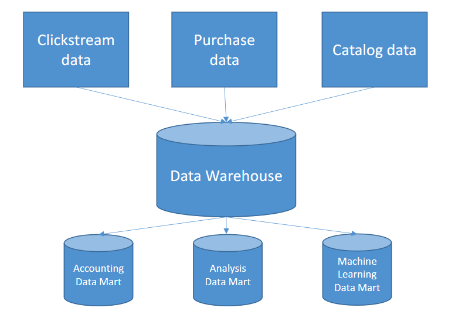
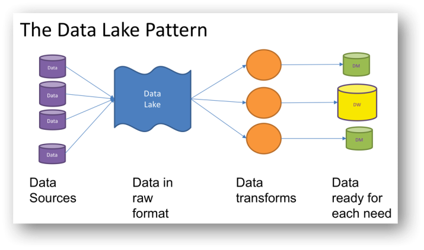

# Data Warehouse vs Data Lake
## Data Warehouse

Repositório de dados centralizado e estruturado, com o objetivo de armazenar dados históricos de uma organização, para fins análiticos.
- Feito para consultas complexas e análises
- ETL
- Normalmente modelado com Star ou snowflake schemas.
- Otimizado para leitura de dados.

### Modelagem de Data Warehouse
**Modelagem Star Schema**
- Tabela fato (dados com métricas e chaves estrangeiras).
- Tabelas de dimensão (armazena os detalhes dos dados de métricas da tabela fato).

**Modelagem Snowflake Schema**
- Extensão da modelagem Star Schema, onde as dimensões são normalizadas.
- Aumenta a complexidade de consultas e reduz a redundância de dados.

**Modelagem Data Vault**
- Tabelas Hubs(representam as entidades centrais do negócio).
    -   Contem chaves naturais (CPF, CNPJ...) e chaves surrogate (IDs).
- Tabelas Links(representam os relacionamento entre outras tabelas).
    - Suportam mudança de relacionamento.
- Tabelas Satélites (Guardam os detalhes e dados históricos das hubs e links). 

## Data Lake
Repositório de dados centralizado que pode armazenar uma grande quantidade de dados brutos (todos os tipos de dados) de diferentes fontes.
- Big data storage
- Sem schema
- Processamento em batch, real-time e stream.

### Modelagem de Data Lake
Modelagem mais fexível comparada a do Data Warehouse, seguindo uma estrutura baseada em camadas:
1. **Raw Layer:** Armazena dados brutos.
2. **Cleansed Layer:** Dados tratados e padronizados.
3. **Curated Layer:** Dados totalmente transformados (agregados, calculados...) otimizado e prontos para consumo.
---
**[Voltar](./data-fundamentals.md)**