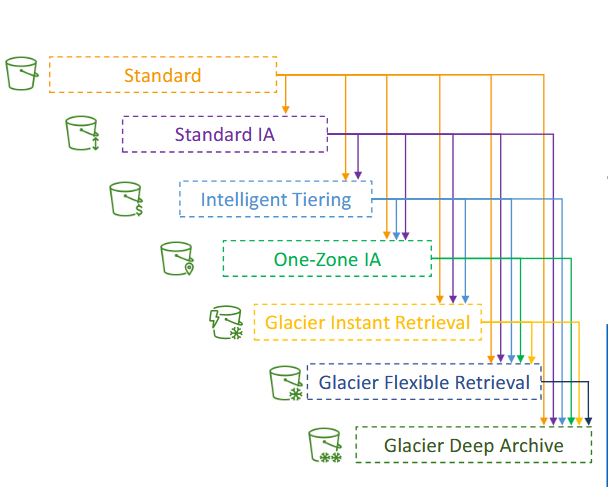

# Classes de Objetos S3
Classes para melhorar o custo de armazenamento dos objetos.
1. **Standard:** Alta durabilidade e baixa latência, indicada para dados acessados com frequência.
2. **Standard-IA:** Dados acessados raramente, mas que quando acessados precisão de rapida recuperação.
3. **Intelligent Tiering:** Classe que automaticamente move para as outras classes de acordo com a necessidade visando otimizar custos.
4. **One Zone-IA:** Similar ao Standard-IA mas armazena o objeto em uma única zona.
5. **Glacier:** Armazenamento para arquivar dados de recuperação lenta e baixo custo.
6. **Glacier Deep Archive:** O armazenamento de menor custo da AWS, recuperação extremamente baixa.

---
**[Voltar](./s3.md)**