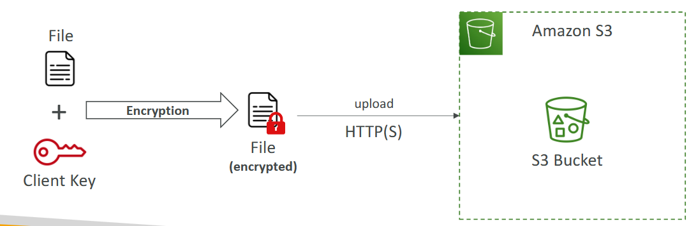

# Criptografia de Objetos S3
O Amazon S3 permite criptografar os objetos armazenados em buckets para aumentar a segurança.

## Criptografia do Lado do Servidor (SSE)
Os dados são criptografados depois de serem enviados para o S3 porém antes de serem armazenados.
### SS3-S3
- Chaves gerenciadas pela AWS.
- Opção padrão para novos buckets e objetos no S3.
- Criptografia AES-256

### SS3-KMS
- Chaves armazenadas no serviço AWS AWS Key Management Service (KMS)
- Maior controle sobre as chaves.
- Pode gerar logs do uso das chaves.
- Pode ter custo adicional por conta do serviços KMS

### SSE-C
- O cliente AWS fornece e gerencia as chaves de criptografia.
- A AWS não possui nenhuma ação sobre as chaves.
- Toda vez que um objeto for acessado, o cliente deve fornecer a chave correspondente.

## Criptografia do Lado do Cliente
- Acontece antes do upload do objeto para o S3.
- O cliente é totalmente responsável pelo gerenciamento das chaves.
- Pode usar o AWS KMS.
- Oferece maior segurança dos dados antes de serem enviados para o S3.

---
**[Voltar](./s3.md)**